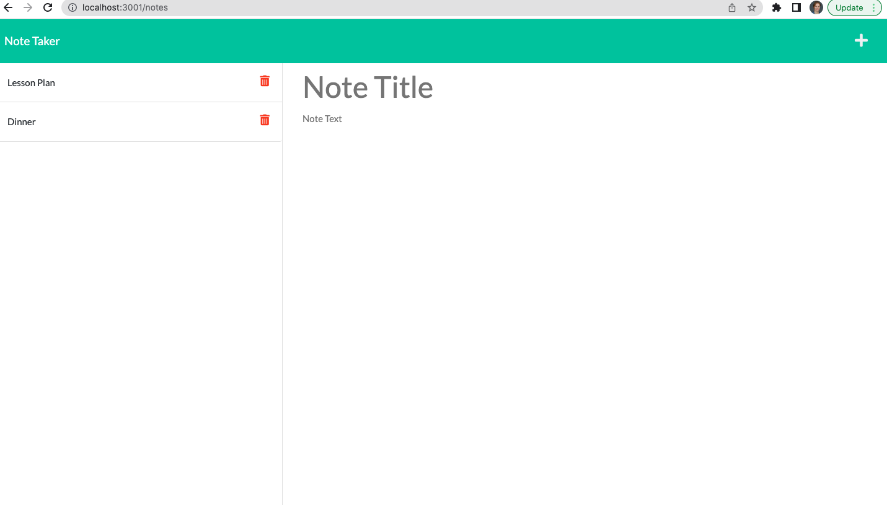
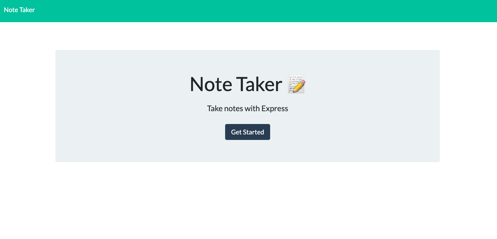

# Note-Taker App

## Description 
This application allows the user to write, save, and delete notes.

## Usage
After opening the website, click the Get Started button.

Enter your note's title and text into the respective fields in the right-hand portion of the screen.

Click the Save icon in the navigation bar in the top right of the screen.
For deleting a note, click the trash can icon.

## Mock-Up

## Technology
- JavaScript
  - Node
  - Express
  - uniqid
  - JSON
  - OOP
- Heroku
- Git and Github

## Questions
Please contact me at: https://github.com/Kubikubiessa or kubikubiessa@gmail.com

## License
 MIT
